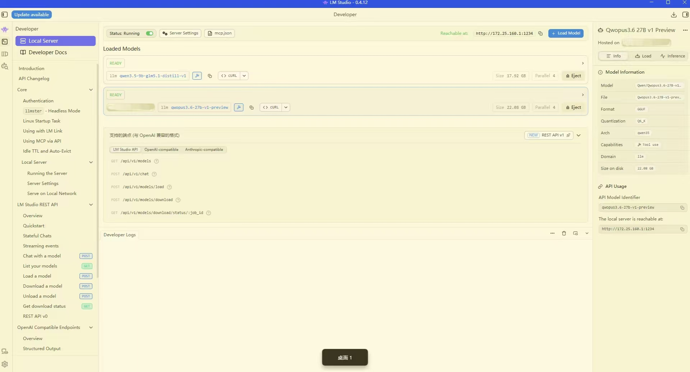

# 📖 小说校勘与润色自动化工具 (Book Refiner)

本项目是一个基于大语言模型（LLM）的本地化小说校勘工具。其核心设计理念是“绝对保守”：在严格保持原著剧情和文风的前提下，通过分块处理和差异审计（Diff Audit），清理小说中的广告、乱码，并修复 OCR 导致的文本缺损，最大限度遏制大模型的“幻觉”和“自由发挥”。

## 🛠️ 1. 环境准备与依赖安装

**环境配置**
```bash
conda create -n book python=3.10 -y
conda activate book
pip install openai tqdm
```

## 🚀 2. 使用 LM Studio 部署本地大模型

工具通过 LM Studio 调用本地模型，以确保文本处理免费且隐私不泄露。


1. **下载与安装**：前往 [LM Studio 官网](https://lmstudio.ai/) 下载对应操作系统的版本并安装。
2. **下载模型**：打开 LM Studio，在搜索框中寻找适合文本处理的中文模型（推荐 `Qwen3.6` 系列，如 27B 或 35B-A3B 版本，具体视你的显存而定）。
3. **启动 Local Server**：
* 点击左侧导航栏的 **```Developer```** ，并点击**```Local Server```**图标。
* 点击顶部的 **```Start Server```** 按钮，使得上方的```Status```变成```Running```。
* 加载准备使用的模型（本地或者通过```LM Link```远程加载都可以）。
* 点击准备使用的模型，观察右侧控制台，复制 `API Usage`下方的模型名称和链接。


## ⚙️ 3. 核心配置说明

运行前，必须打开脚本文件，修改开头的 `CONFIG` 字典以匹配你的本地环境和处理需求。

```python
CONFIG = {
    "MODE": 1,

    # 输入输出路径
    "INPUT_TXT": "book.txt",
    "OUTPUT_TXT": "outputs/book-refined.txt",

    # LM Studio API
    "BASE_URL": "http://172.25.160.1:1234/v1",
    "MODEL": "qwopus3.6-27b-v1-preview",

    # 模型生成参数
    # MODE 0 建议低温，避免乱改。
    # MODE 1 可以略高一点，但仍然要保守。
    "TEMPERATURE": {
        0: 0.15,
        1: 0.20,
    },
    "TOP_P": {
        0: 0.90,
        1: 0.90,
    },

    # 单次最大输出 token。
    # 如果模型输出被截断，可以调大。
    "MAX_TOKENS": 81920,

    # 章节过长时，按字符数切块。
    "CHUNK_CHARS": 30000,

    # MODE 1 下，每个 chunk 会额外提供前后文，但要求模型只输出当前 chunk。
    "CONTEXT_CHARS": 50000,

    # 是否启用断点续跑。 True 表示如果某章结果已经存在，就直接读取，不重复调用模型。
    "RESUME": True,

    # 是否自动回退可疑输出。如果 True，审计发现模型改动过大时，直接保留原文。
    "REJECT_SUSPICIOUS": False,

    # API 调用失败重试次数
    "RETRIES": 2,
}

```

**配置项详解：**

* **`MODE`（核心模式）**：
  * 设为 `0`：仅做保守去广告和错别字修正。适用于排版较好、仅有少量广告的文本。
  * 设为 `1`：缺损修复模式。除了校勘，还会根据上下文推断修补漏字和断裂的语意。适用于粗糙的盗版或 OCR 文本。


* **`INPUT_TXT` / `OUTPUT_TXT`**：待处理的小说原始文件路径，以及处理完成后的纯净版长文本保存路径，其中：
  * `INPUT_TXT`是待处理的小说txt路径。
  * `OUTPUT_TXT`是处理后的小说的保存路径，建议写成```outputs/book-refined.txt```的形式，```outputs```代表工作路径，```book-refined.txt```代表修改后的文件名，各种中间输出也会保存到```outputs```下。
* **`BASE_URL`**：**必须修改**。改为你在 LM Studio 启动 Local Server 时看到的地址。
* **`MODEL`**：使用的模型名称。建议与 LM Studio 中加载的模型名称保持一致。
* **`CHUNK_CHARS`（分块大小）**：单次喂给模型的字符数。**如果你的模型上下文窗口较小（如 8k），请务必将其调小至 `3000-5000**`，否则结尾会被截断。
* **`RESUME`（断点续跑）**：设为 `True` 时，意外中断后重启工具，已处理完的章节将被自动跳过，不重复消耗时间。
* **`REJECT_SUSPICIOUS`（异常回退）**：设为 `True` 时，若审计日志发现某段文本修改幅度异常大，工具会判定模型“发疯”，直接丢弃生成结果并保留原文。
* **`RETRIES`（失败重试）**：LLM 调用失败时重新尝试的次数。

## 💻 4. 运行与输出结果验证

配置完成后，在终端运行脚本：

```bash
python book-refine.py
```

为了回答“每个修改为什么发生”，脚本在运行完毕后会在 `outputs/` 目录下生成完整的追溯文件：

1. **`outputs/book-refined.txt`**: 最终拼接好的纯净版小说。
2. **`outputs/chapters/`**: 逐章输出的 `.txt` 缓存文件（支持断点续跑的基础）。
3. **`outputs/logs/audit.jsonl`**: 审计日志。记录了每一章模型处理的删减率、扩写率以及是否触发异常警告（如输出了“以下是修改后文本”等废话）。
4. **`outputs/logs/*.diff.html`**: **高亮网页对比文件（核心功能）**。你可以直接用浏览器打开这些 HTML 文件，左侧是原文，右侧是修改后内容，红绿色高亮会清晰地向你展示大模型到底删了什么、改了什么。
